# 小白鲸找妈妈

郭一隆 2013011189

## 单频模拟

### 小白鲸原声

+ 生成代码:

  ```matlab
  original = wavread('whalesong.wav')
  fs = 44.1e3
  plot([0:1/fs:(length(original)-1)/fs],original),title('小白鲸原声')
  ```

  *.wav默认采样率为44.1kHz*

+ 音频曲线:

  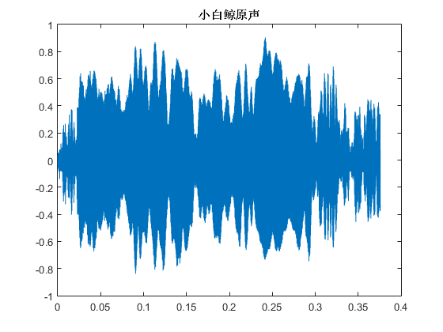

  从图中可以直观地感受到频率很高, 这和我们听到的直观(音调高)是符合的.


+ 局部放大图:

  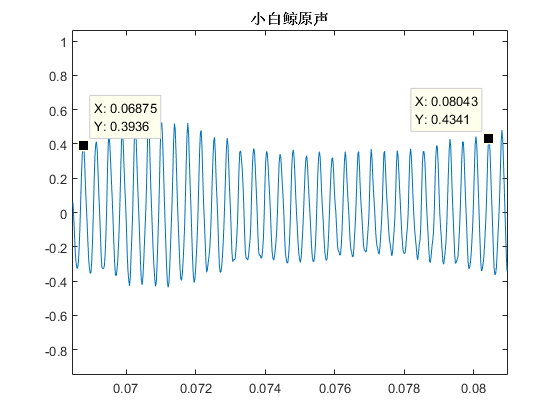

  - 从图像估算频率
  
    ```
    f = ((0.2006 - 0.1988) / 31) ^ -1 = 2.654 kHz
    ```
  
  - 频域分析

    ```matlab
    % src/fft_original.m
    fs = 44.1e3;            % sampling rate: 44.1kHz
    N = length(original);   % sample size
    n = 0:N-1;
    t = n / fs;             % time sequence
    f = n / N * fs;         % frequency sequence

    y = fft(original, N);
    plot(f, abs(y));
    title('频域分析');
    ```

    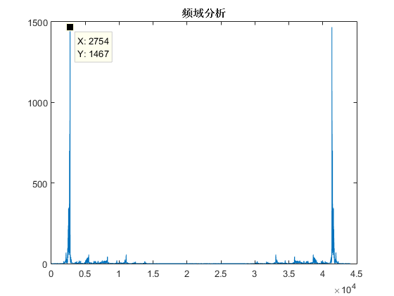
  
    ```matlab
    [Y, I] = max(abs(y))
    fe = I / N * fs
    ```

    得`fe = 2.757 kHz`

+ 显然利用`FFT`得到的结果更靠谱, 利用`fe = 2.757 kHz`的单频信号模拟, 生成[synfixed.wav](wav/synfixed.wav)
  ```matlab
  single_f_wav = sin(2*pi*fe*t)
  wavwrite(single_f_wav, fs, 16, 'G:\projects\whale-song\wav\synfixed.wav')
  ```
  - 整体波形
    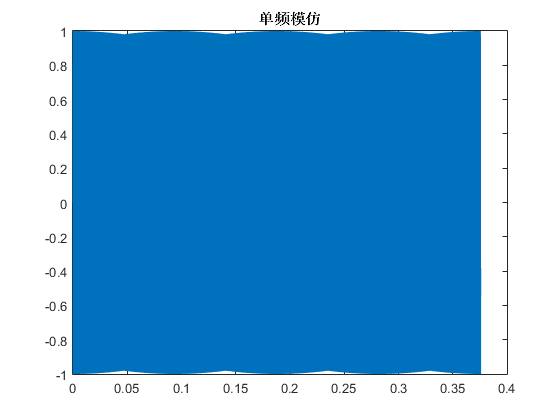

  - 局部放大
    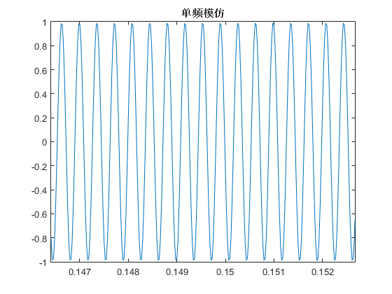

  然而, 这并没有什么卵用, 因为这个单频信号听起来就像被*打码*的语音... 脑洞如此大的笔者也想象不出这是白鲸的叫声


## 变频模拟

+ 时频图
  
  ```matlab
  % src/t_f_plot.m
  [S,F,T,P] = spectrogram(original, 1024, 500, 1024, fs);
  surf(T,F,10*log10(P),'edgecolor','none');
  view(0,90);
  xlabel('t/s');
  ylabel('f/Hz');
  axis([0 0.37 0 1.5e4]);
  title('原声时频图');
  ```
  
  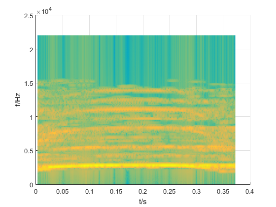

  由时频图可以看出:

    - 白鲸歌声频域的能量主要集中在`2757Hz`左右

    - 还有少部分能量分布在其他频率段(单边带宽约为`15kHz`)

    - 频域能量分布随时间变化

    - 能量最集中的频段也有略微变化, `t < 0.06s`时主频率单调上升, `t > 0.30s`时主频率单调下降

  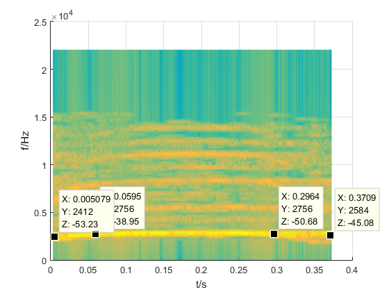

    由上图估算:

    - `f(t=0) = 2412 Hz`

    - `f(t=0.06) = 2756 Hz`

    - `f(t=0.30) = 2756 Hz`

    - `f(t=0.37) = 2584 Hz`

+ 产生模拟信号

  - 频域: **分段折线逼近**

    ```matlab
    % src/single_f_estimate.m
    y1 = chirp(0:1/fs:0.06, 2412, 0.06, 2756);
    y2 = chirp(0.06:1/fs:0.30, 2756, 0.30, 2756);
    y3 = chirp(0.30:1/fs:0.37, 2756, 0.37, 2584);
    signal1 = [y1,y2,y3];

    subplot(1,1,1);
    [S,F,T,P] = spectrogram(signal1, 1024, 500, 1024, fs);
    surf(T,F,10*log10(P),'edgecolor','none');
    view(0,90);
    xlabel('t/s');
    ylabel('f/Hz');
    axis([0 0.37 0 1.5e4]);
    title('变频模拟');
    ```

    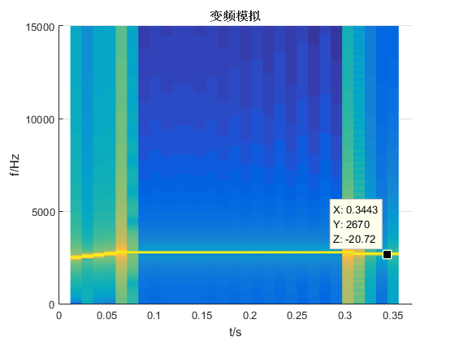

    *注: 时频图上有少量其他频率分量, 可能是离散信号取点不精确造成的*

  - 时域: **原声包络**

    ```matlab
    % src/find_envelope.m
    size = 16500;
    Y = original(1:size);
    d = 165;    % length of each part
    y = reshape(Y, d, size/d);  % y: d * size/d matrix
    y = max(y);     % maximum of each column
    x = linspace(0, max(t), size/d);   % linear interpolation

    subplot(1,1,1); plot(t, original);
    title('原声'); xlabel('t/s'); axis([0 0.37 0 1]);
    hold on;
    plot(x,y);
    title('原声包络'); xlabel('t/s'); axis([0 0.37 0 1]);
    ```

    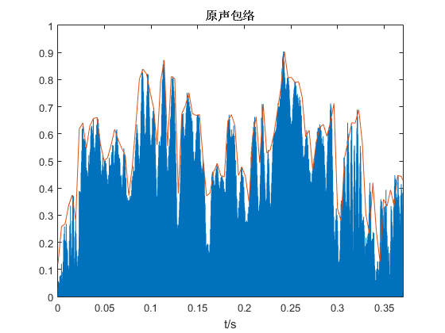

    **利用原声包络调制产生的变频信号**

    ```matlab
    % src/single_modulation.m
    mag = interp1(x,y,0:1/fs:16319/fs);   % run find_envelope.m first

    subplot(3,1,1); plot(t,original);
    axis([0 0.37 -1 1]); title('原声'); xlabel('t/s');

    subplot(3,1,2); plot(t(1:length(mag)),signal1);   % run single_f_estimate.m first
    axis([0 0.37 -1 1]); title('变频模拟(局部)'); xlabel('t/s');

    subplot(3,1,3); plot(t(1:length(mag)),mag.*signal1);    
    axis([0 0.37 -1 1]); title('变频模拟调幅'); xlabel('t/s');
    ```

    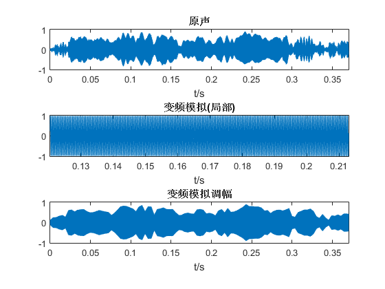

    ```matlab
    wavwrite(mag.*signal1,fs,16,'G:\projects\whale-song\wav\synsingle.wav')
    ```

    生成[synsingle.wav](wav/synsingle.wav), 这次模拟的信号已经和原声有些相似, 听得出声音强度的变化, 但音调仍然很单一, 而且声音不够饱满, 而且有杂音.


## 多变频模拟
  
  - 进一步分析原声时频图

    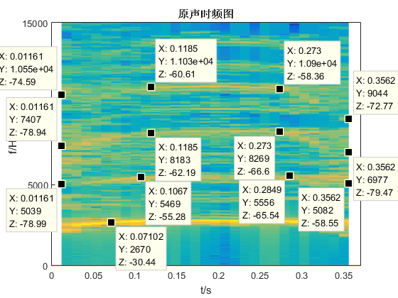

    *如法炮制*

    ```matlab
    % src/synmulti.m
    % src/synmulti.m
    y1 = chirp(0:1/fs:0.11, 5039, 0.11, 5469);
    y2 = chirp(0.11:1/fs:0.28, 5469, 0.28, 5556);
    y3 = chirp(0.28:1/fs:0.36, 5556, 0.36, 5082);
    dB = 1e-2;           % -20dB
    signal2 = dB * [y1,y2,y3];

    y1 = chirp(0:1/fs:0.12, 7407, 0.12, 8183);
    y2 = chirp(0.12:1/fs:0.27, 8183, 0.27, 8269);
    y3 = chirp(0.27:1/fs:0.36, 8269, 0.36, 6977);
    dB = 1e-2;           % -20dB
    signal3 = dB * [y1,y2,y3];

    y1 = chirp(0:1/fs:0.12, 10550, 0.12, 11030);
    y2 = chirp(0.12:1/fs:0.27, 11030, 0.27, 10900);
    y3 = chirp(0.27:1/fs:0.36, 10900, 0.36, 9044);
    dB = 1e-2;           % -20dB
    signal4 = dB * [y1,y2,y3];

    size = min([length(signal1),length(signal2),length(signal3),length(signal4)]);

    signal1 = signal1(1:size);  % cut
    signal2 = signal2(1:size);
    signal3 = signal3(1:size);
    signal4 = signal4(1:size);
    signal = signal1 + signal2 + signal3 + signal4;

    [S,F,T,P] = spectrogram(signal, 1024, 500, 1024, fs);
    surf(T,F,10*log10(P),'edgecolor','none');
    view(0,90);
    xlabel('t/s');
    ylabel('f/Hz');
    axis([0 0.37 0 1.5e4]);
    title('多变频模拟');
    ```

    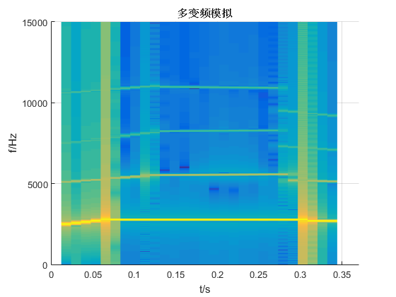

  - 调整包络参数, 获取更加**丧心病狂**的原声包络

  ```matlab
  size = N;
  Y = original(1:size);
  d = 12;    % length of each part
  y = reshape(Y, d, size/d);  % y: d * size/d matrix
  y = max(y);     % maximum of each column
  x = linspace(0, max(t), size/d);   % linear interpolation

  subplot(1,1,1); plot(t, original);
  title('原声'); xlabel('t/s'); axis([0 0.37 0 1]);
  hold on;
  plot(x,y);
  title('原声包络'); xlabel('t/s'); axis([0 0.37 0 1]);
  ```

  *黄色为原声波形, 紫色为逼近的包络*

  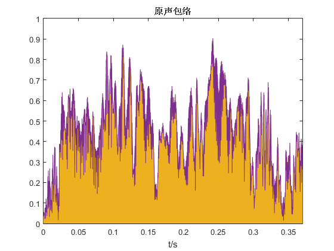

  ```matlab
  % src/multi_modulation.m
  % first, run find_envelope.m and synmulti.m respectively
  mag = interp1(x,y,0:1/fs:(size-1)/fs);

  subplot(3,1,1); plot(t,original);
  axis([0 0.37 -1 1]); title('原声'); xlabel('t/s');

  subplot(3,1,2); plot(t(1:length(mag)),signal);
  axis([0 0.37 -1 1]); title('多变频模拟(局部)'); xlabel('t/s');

  subplot(3,1,3); plot(t(1:length(mag)),mag.*signal);    
  axis([0 0.37 -1 1]); title('多变频模拟调幅'); xlabel('t/s');

  wavwrite(mag.*signal,fs,16,'G:\projects\whale-song\wav\synmulti.wav');
  ```

  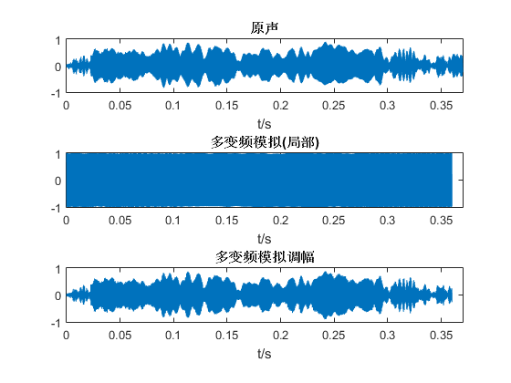

  生成[synmulti1.wav](wav/synmulti1.wav), 仔细聆听, 感觉竟然还不如单频模拟信号相似度高..

  经过调试, 发现是丧心病狂的包络调制使得信号失真了, 使用原来的包络参数重新得到[synmulti.wav](wav/synmulti1.wav)

  经过不懈的试听, 终于听出[synmulti.wav](wav/synmulti1.wav)似乎比[synsingle.wav](wav/synsingle.wav)有更多情感投入! 但和原声相比, 合成的音色仍然十分干涩.

## 混响模拟

  在`Cool Edit Pro`里经过一番瞎折腾.. 时频图是这么变的..

  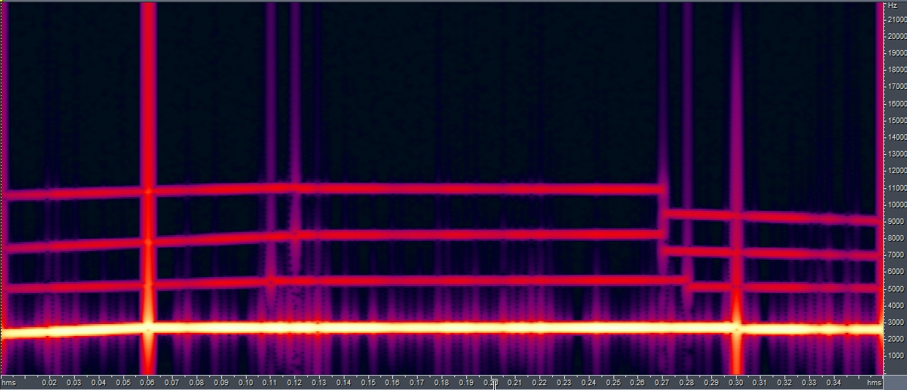

  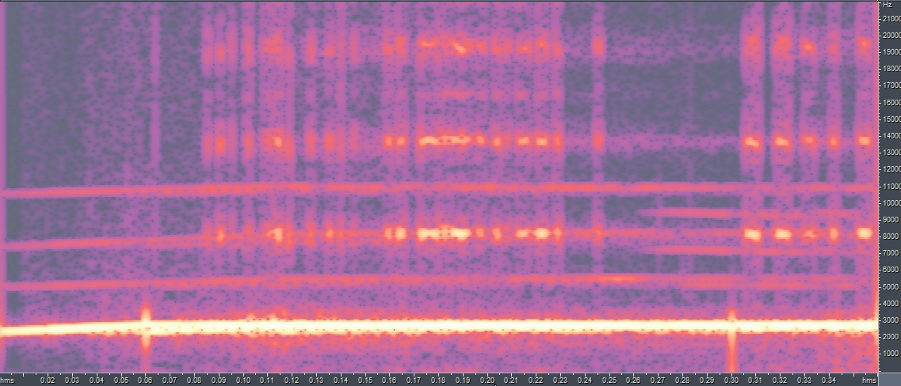

  而小白鲸明明是这样的...

  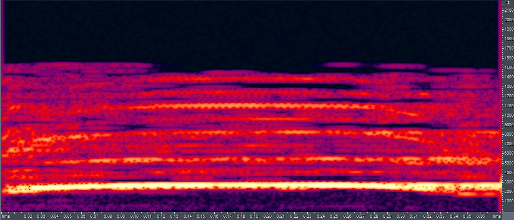

  合成出[synmultireverb1.wav](wav/synmultireverb1.wav), 嗯, 不出所料, 果然还是很不像.. 已报警...

**是在下输了, 还是华小强会玩..**
